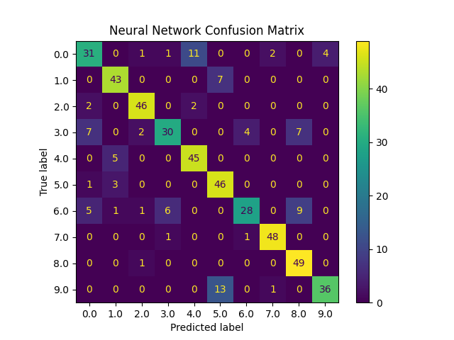
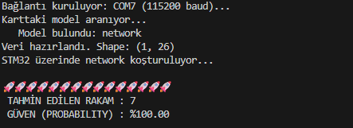
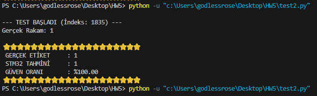

# Embeded-image-Processing-HW5
**Members:**
| Name               | Student ID |
|--------------------|--------------|
| **Eren Karagül**   | 150722007     |
| **Mehmet Akif Takcı** | 150721058   |

---
Q1 - Keyword Spotting from Audio Signals 
---
In this section first we trained a neural network model for keyword spotting from audio signals. Using code provided by the textbook. Code is given in the "training.py" file. Neural network confusion matrix formed by the neural network is given below.

  

After getting our network model we used the ST Edge AI Developer Cloud to generate our STM32 code and upload it to the "STM32 Nucleo-F44RE" board. And we used the code "test1.py" included in the repository to send sound file and recieve its output from the STM32. Output from the code is given below.

  

---
Q2 - Handwritten Digit Recognition from Digital Images
---
In this section first we used the neural network model that we used in the homework 4. And using the ST Edge AI Developer Cloud to generate our STM32 code and upload it to the "STM32 Nucleo-F44RE" board. After uploading the STM32 code we used the "test2.py" to upload random test image files and recieving our result. Output of the code is given below

  

